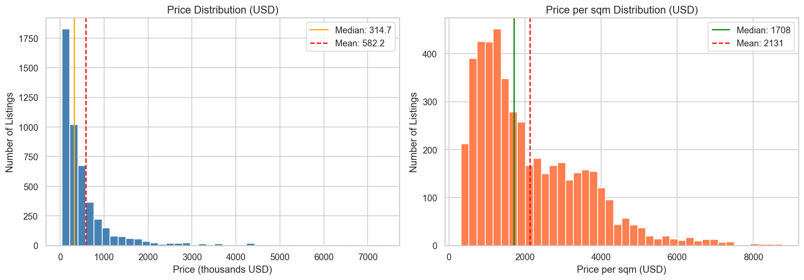
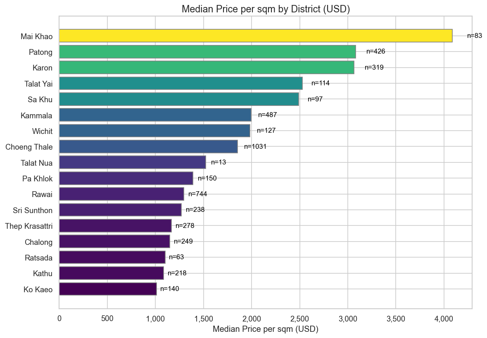
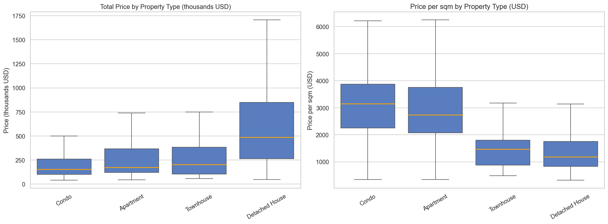
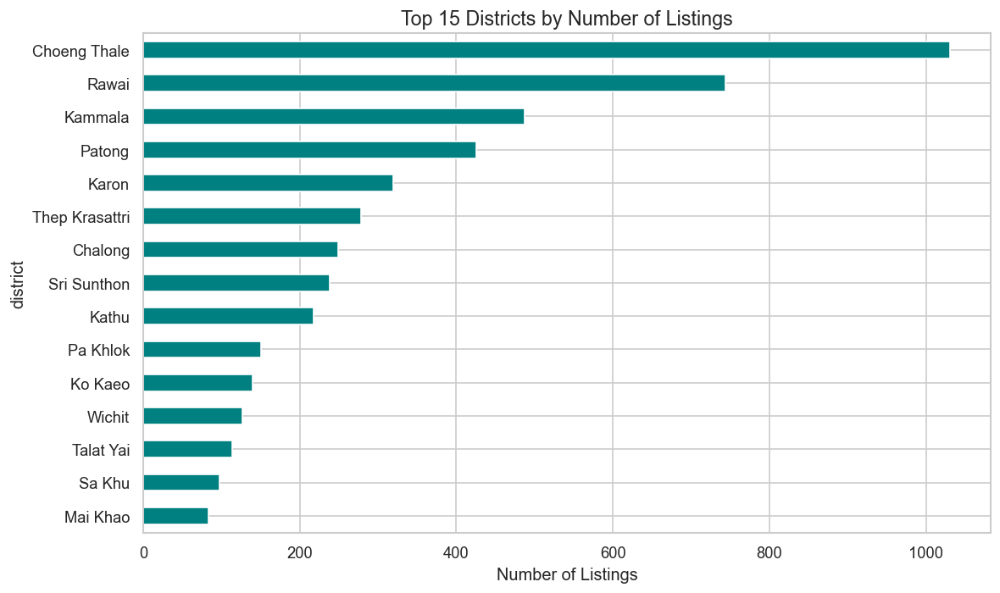
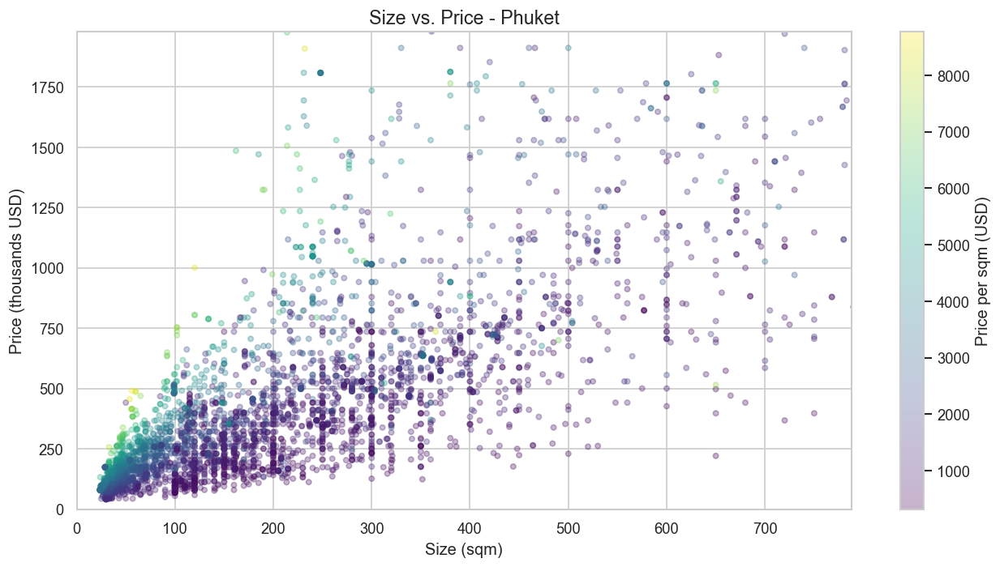
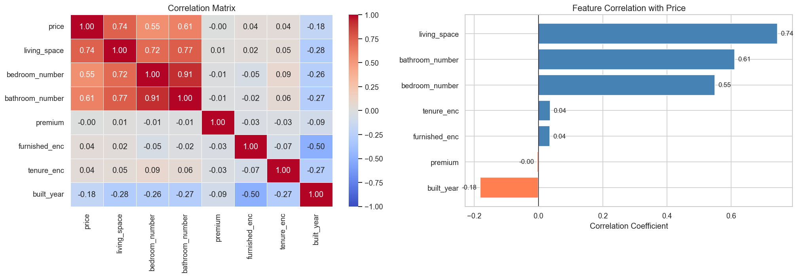
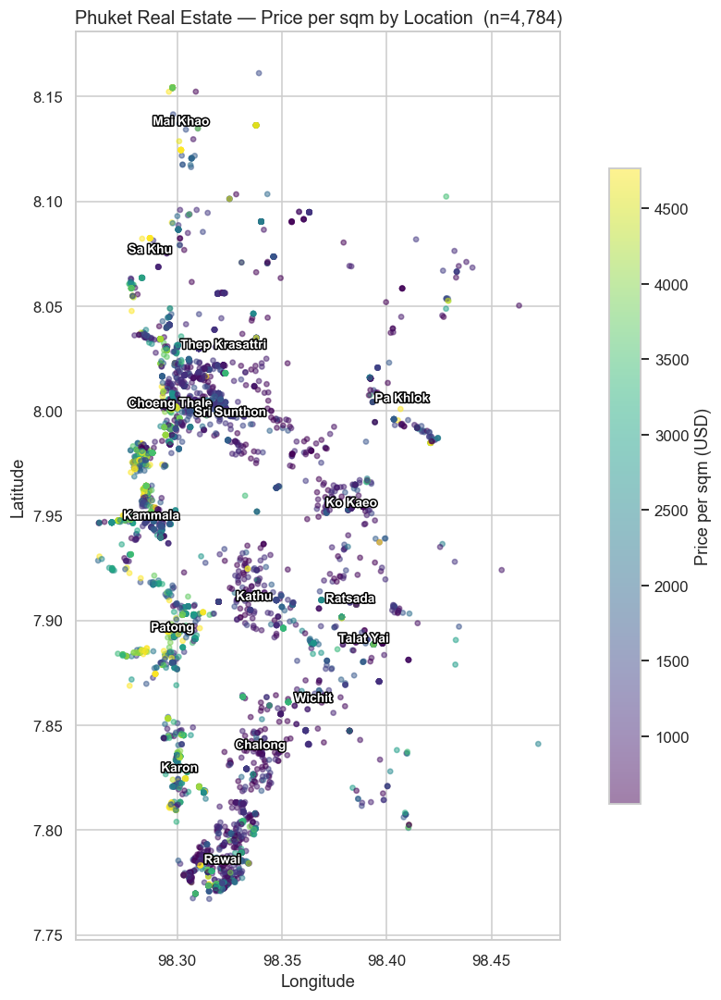
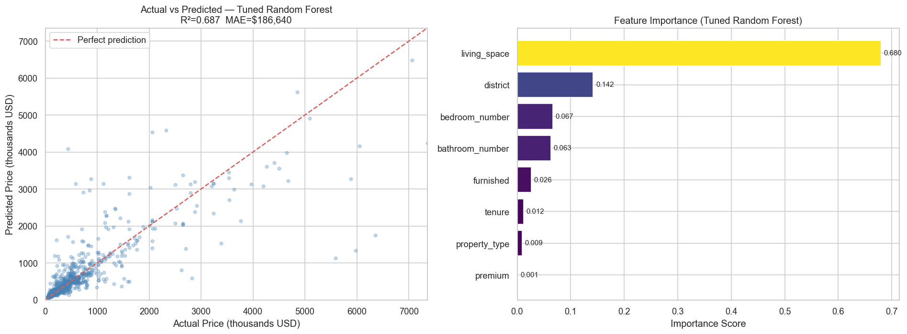
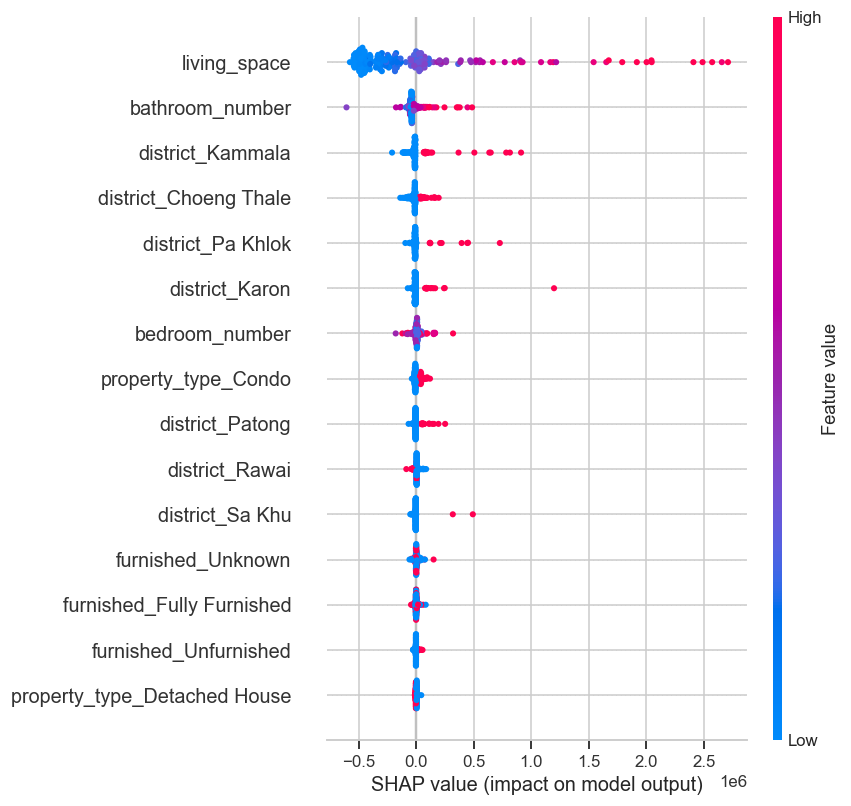

# 🏠 Phuket Real Estate Market Analysis

Exploratory data analysis + price-prediction model for the Phuket (Thailand) property market, based on **4,786 real listings** across **19 districts**, with an interactive geographic heatmap.

---

## 📌 Objective

Identify pricing patterns, compare districts and property types, uncover the key drivers of real estate prices in Phuket, and build a Random Forest model that predicts property price from listing features.

**Questions answered:**
- What is the price distribution across the Phuket market?
- Which districts are the most expensive and most affordable per sqm?
- Which property type offers the best value?
- What features (size, bedrooms, bathrooms, district) drive the price most?
- Can we predict a property's price from its features?

---

## 📊 Key Findings

| Metric | Value |
|--------|-------|
| Total listings analyzed | 4,786 |
| Districts covered | 19 |
| Median price | $314,706 (~10.7M THB) |
| Median price per sqm | $1,708 (~58K THB) |
| Mean price | $582,157 (market skewed by luxury villas) |

**Most expensive districts (price/sqm, USD):**
1. 🥇 Mai Khao — $4,088/sqm
2. 🥈 Patong — $3,080/sqm
3. 🥉 Karon — $3,063/sqm

**Most affordable districts (price/sqm, USD):**
1. Ko Kaeo — $1,012/sqm
2. Kathu — $1,086/sqm
3. Ratsada — $1,101/sqm

**Property types by median total price:**
| Type | Median Price | Median Size | Price/sqm |
|------|-------------|-------------|-----------|
| Detached House | $485,294 | 279 sqm | $1,189 |
| Townhouse | $203,912 | 141 sqm | $1,471 |
| Apartment | $173,529 | 65 sqm | $2,734 |
| Condo | $155,882 | 49 sqm | $3,150 |

> 💡 **The Condo Paradox:** Condos are the cheapest in total price but the most expensive per sqm — a common pattern in tourist-driven markets where small premium units are priced for rental yield.

**Price drivers (Pearson correlation with price):**
- Living space: **0.72** (strongest)
- Bathrooms: **0.60**
- Bedrooms: **0.54**

**Statistical confirmation (Mann-Whitney U):**
- Patong vs Kathu: **p ≈ 1.6 × 10⁻⁶⁰**, Cliff's δ = +0.78 → premium-coastal vs cheap-inland gap is real, not noise
- Patong vs Karon: **p = 0.54**, Cliff's δ = +0.03 → two premium beach districts are statistically indistinguishable (sanity check)

---

## 🤖 Price Prediction Model

Trained three models on **3,828 listings** (test set: 958), using sklearn `Pipeline` with `OneHotEncoder` + `StandardScaler`. The final RF is tuned with `GridSearchCV` (8 combinations × 5-fold CV):

| Model | R² (hold-out) | R² (CV) | MAE |
|-------|---------------|---------|-----|
| Linear Regression | 0.540 | 0.569 ± 0.038 | $285,969 |
| Random Forest (default) | 0.689 | 0.655 ± 0.046 | $182,094 |
| **Random Forest (tuned)** | **0.687** | **0.705** | **~$187K** |

GridSearchCV grid: `n_estimators ∈ {200, 400}`, `max_depth ∈ {None, 15}`, `min_samples_leaf ∈ {1, 2}`. The tuned model picks up an extra ~5 pp on cross-validation — more reliable than the single hold-out.

**Tuned Random Forest — feature importance (aggregated across one-hot levels):**
| Feature | Importance |
|---------|-----------:|
| living_space | 67.7% |
| district | 14.1% |
| bedroom_number | 6.8% |
| bathroom_number | 6.4% |
| furnished | 2.8% |
| tenure | 1.2% |
| property_type | 0.9% |
| premium | 0.1% |

Living space + district together explain ~82% of the model's predictive power. Marketing labels (`furnished`, `premium`) barely contribute.

See `SHAP — Feature Impact in Dollars` below for a more granular view: SHAP shows the per-listing dollar impact of each feature, not just split frequency.

---

## 📈 Visualizations

### Price Distribution


### Price per sqm by District


### Price by Property Type


### Listings Count by District


### Size vs. Price


### Feature Correlation


### Geographic Heatmap


> 🗺 **Interactive version:** [`visuals/phuket_map.html`](visuals/phuket_map.html) — open in a browser to zoom into clusters and see the 5 most expensive listings as red markers (folium heatmap, weighted by price/sqm).

### Model Results


### SHAP — Feature Impact in Dollars


Unlike `feature_importances_` (which counts how often a feature was used in splits), SHAP shows **how each feature pushed each prediction up or down** in dollars. Each dot is one listing; red = high feature value, blue = low. `living_space` swings predictions by up to ~$2.5M; being in `Kammala` or `Karon` pushes premium listings significantly higher.

---

## 🛠 Tools & Libraries

- **Python 3.11+**
- `pandas` / `numpy` — data cleaning & analysis
- `matplotlib` / `seaborn` — visualizations
- `folium` — interactive geographic heatmap
- `scipy.stats` — Mann-Whitney U test for district price differences
- `scikit-learn` — `Pipeline`, `ColumnTransformer`, `OneHotEncoder`, `RandomForestRegressor`, `LinearRegression`, `GridSearchCV`, `cross_val_score`
- `shap` — feature impact analysis (`TreeExplainer`)
- **Jupyter Notebook**

---

## 📁 Project Structure

```
phuket-real-estate/
├── data/
│   ├── raw/              ← original Kaggle dataset (not committed, too large)
│   └── cleaned/          ← cleaned Phuket subset (CSV)
├── notebooks/
│   └── phuket_analysis.ipynb  ← main analysis + ML model
├── visuals/              ← all exported charts
└── README.md
```

---

## 🗂 Data Source

[200k+ Homes for Sale in Thailand — Kaggle](https://www.kaggle.com/datasets/polartech/200k-homes-for-sale-in-thailand)

Filtered to Phuket province only. Raw data not included due to file size.

---

## 👤 Author

**Tamirlan** — aspiring Data Analyst
📍 Relocating to Thailand | Open to remote DA roles
